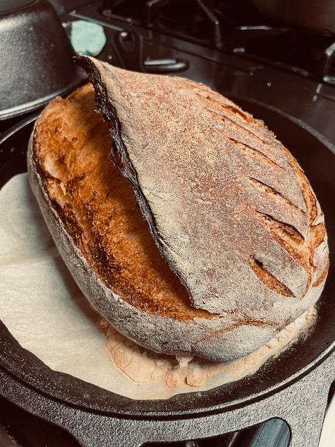

# Ingredients

* 500g White bread flour (or some combination with roughly the same weight of bread & darker flours)
* 390g Water (78% Hydration) 
* 100g starter at peak “activeness” (20% by weight) 
* 11g salt (2.2% by weight) 

# Process (Start in the morning):

1. Autolyse - mix of the flour and water, leave for 3 hours in a warm area, try the window pane technique to see if there has been a development of gluten
2. Add the starter to the autolyse mixture, folding the mixture in the bowl until starter is fully incorporated, takes 4-5 minutes. 
3. Rest for 30 minutes 
4. Add the salt and mix until fully incorporated, again around 4-5 minutes 
5. Rest for 30 minutes 
6. Do your first fold with the dough and then proceed by returning the dough to the bowl. Easy fold, start by pulling the top over, then bringing in the sides and finally folding up the bottom 
7. Rest for 30 minutes 
8. Lamination process 
    1. Should be able to do with just a wet counter and no flour 
    2. Pull from the middle and spreading the dough out across the counter to form a 1/2 inch thick rectangle 
    3. Once you have established your rectangle, you will want to fold 1/3 of the rectangle in over the middle and then the other 1/3 on top to make 3 layers 
    4. Then fold 1/3 down from the top and up from the bottom creating 6 layers (At this step you can add fruits or nuts if desired). This process will help to strengthen your gluten development at an early stage 
9. Rest for 60 minutes 
10. Now begin the stretch and fold which will happen 4 times over the course of 4 hours 
    1. Folding the dough by pulling up the middle and folding the outside edge into the middle
    2. Doing this four times, one fold per side 
11. After the stretch and folds, you can pre-shape the dough 
12. Rest for 20 minutes 
13. Final shaping and into the proofing basket with lots of flour to prevent sticking and the creation of a skin on the dough 
14. Proof overnight in the fridge for 12-14 hours 

# Baking

1. Preheat the oven to 500 degrees with the dutch oven inside or baking dish 
2. Once preheated, remove the bread from the fridge and score directly before putting the bread in the oven
3. Bake covered at 500 degrees for 20 minutes 
4. Keep covered and turn down the heat to 450 and continue baking for 10 minutes
5. Remove lid and bake for an additional 25 minutes until you get a dark crispy crust
