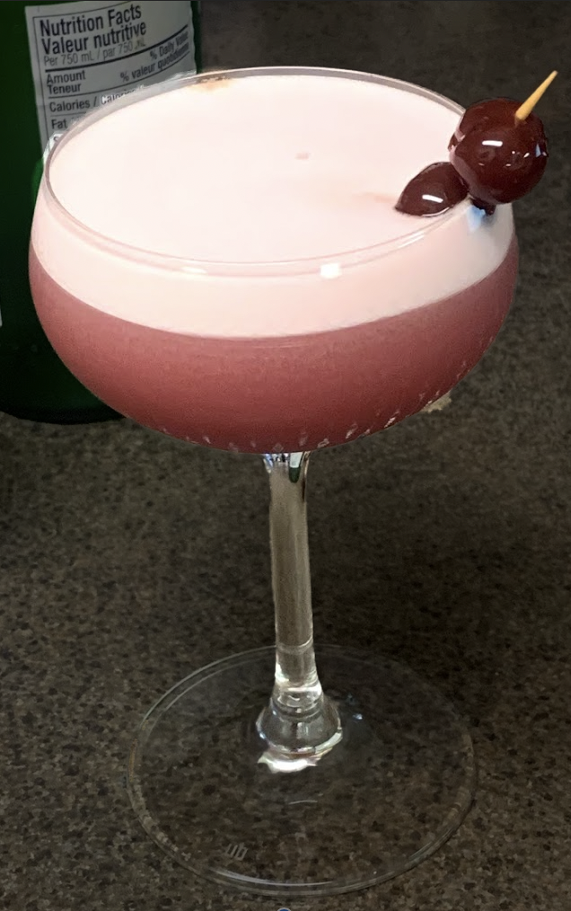

# Ingredients

* 2 oz Scotch
* 1 oz fresh lemon juice
* 1/2 oz cassis
* 1/2 oz simple syrup
* dash orange bitters
* 1 egg white

# Steps

1. In a cocktail shaker without ice, combine 2 ounces of Scotch, 1 ounce of fresh lemon juice, ¾ ounce of cassis, ½ ounce of simple syrup (equal parts sugar and water) and a dash of orange bitters. Add the white from one egg, being careful not to get any yolk in there.
1. Shake the cocktail without ice for about 30 seconds–that starts to whip up the egg white. You’ll know you’ve shaken enough when the shaker almost pops itself apart. 
1. Add ice and shake again. Strain into a cocktail glass. 
1. Garnish with dark fruit: We used brandied cherries, but a blackberry would look lovely, too.

