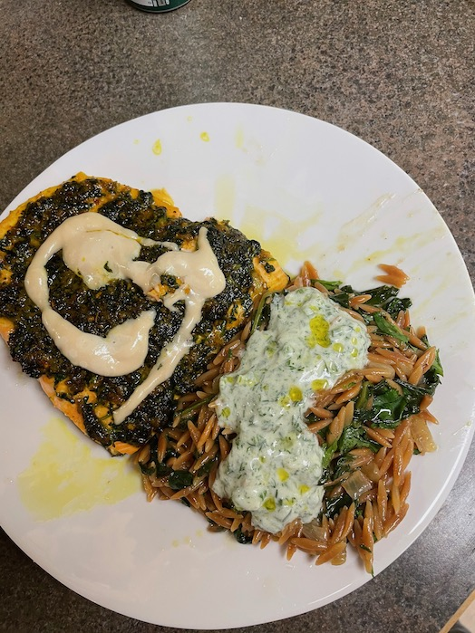

# Ingredients

* 1 1/3 cup (250g) orzo 
* 5 tbsp / 70mL olive oil
* 2 onioins, roughly chopped
* 1 lb 2 oz / 500g spinach
* salt and pepper
* 2 cups plus 2 tbsp / 500 mL water

## Dill and chile yogurt

* 2/3 c / 200g greek yogurt
* 1 green chile, seeded and finely chopped
* 1 garlic clove, crushed
* 1/2 c dill, finely chopped
* 1 tbsp lemon juice
* 1 1/2 tbsp olive oil
* 1/4 tsp salt

## Addons
* 1 1/2 c cilantro, finely chopped
* 1 lemon, cut into wedges

# Steps

1. place a laurge sauté pan with a lid over high heat; add the orzo and toast for
   10 minutes (or less if it goes fast), stirring very frequently.  Tip the toasted orzo 
   into a bowl and set aside.
1. Return the same pan to medium heat and add the olive oil and onions. Cook 
   for about 8 minutes stirring a few times, until onions start to get golden.  
   Add the spinach, in batches, stirring until wilted.  Add 1 tsp of salt and a 
   good grind of black pepper, then pour in the water.  Bring to a gentle boil and 
   add the orzo, strirring it in.  Decrease the heat to low and cook, covered, for 
   10 minutes, until orzo is just cooked bu retains a bit of bite.
1. To make the yogurt, mix together all ingredients and set aside.
1. Just before serving, stir in the cilantro into the orzo. Divide among four bowls 
   and top with the yogurt. Serve with a drizzle of olive oil and lemon wedges alongside.
   
   
