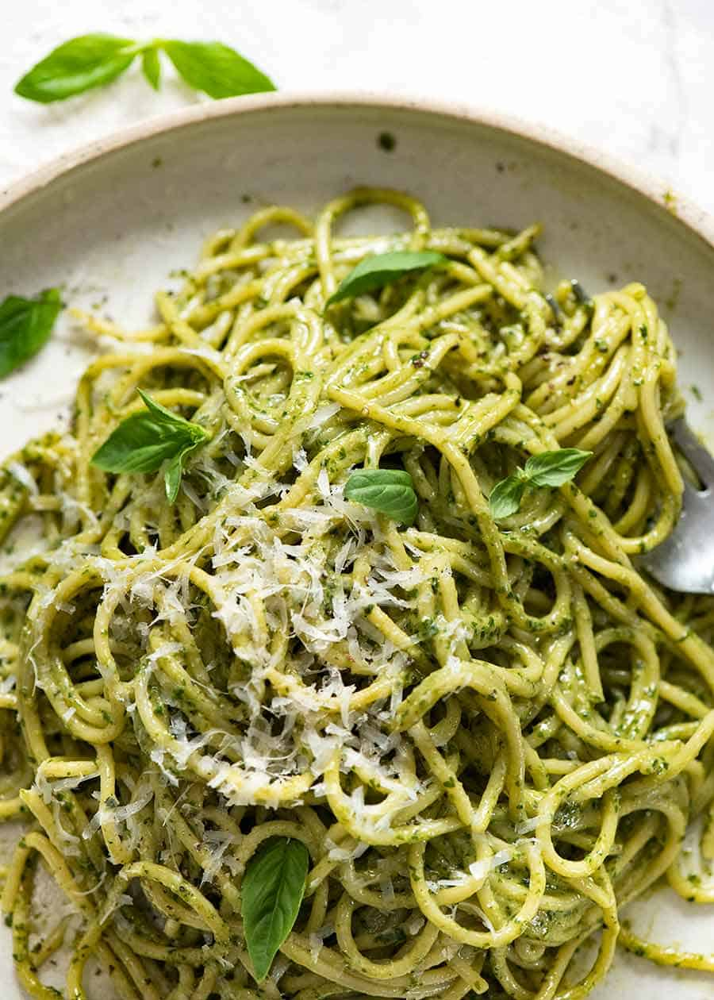

# Pesto pasta

The pesto paste freezes well -- good to split up in small tupperwares to able to thaw enough for a meal without thawing and refreezing all of it.

## Ingredients

* 2c basil \(about 150g\), firmly packed including tender stems 
* zest of a lemon \(or most of it\)
* Juice of 1 lemon
* 6 cloves of garlic
* 100g pine nuts
* 1/2c Parmesan or pecorino cheese
* 1 tsp salt
* 1/2 tsp pepper
* 1/2 cup olive oil

## Steps

1. Lightly toast pine nuts in a dry skillet
2. Put everything but the oil in a food processor; pulse to break up nuts and garlic, then flip switch and start to add olive oil
3. When mixture turns to a loose paste, you are done.

Store in a plastic container and drizzle oil on top to prevent oxidation.

When ready to use, mix with some pasta water \(1/2 c?\) to thin and melt the cheese before adding the pasta.

